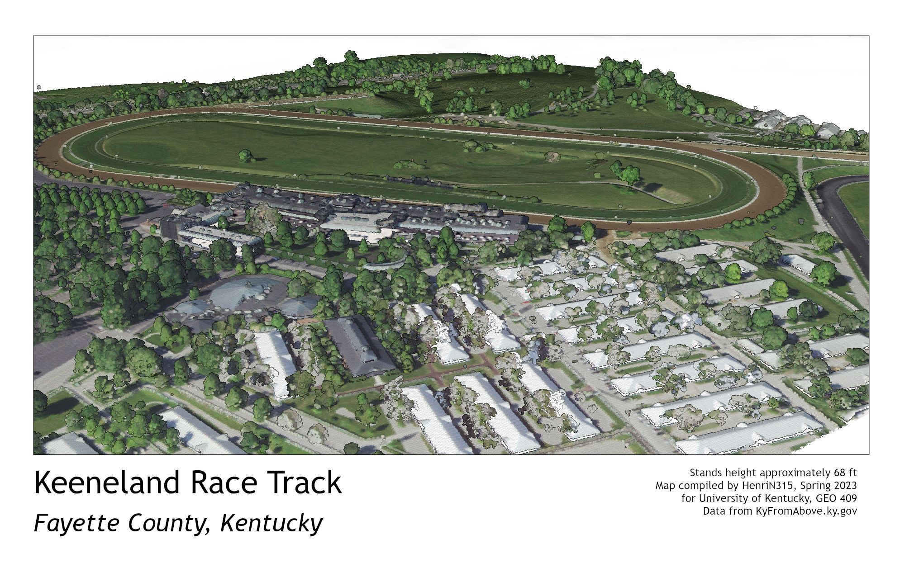
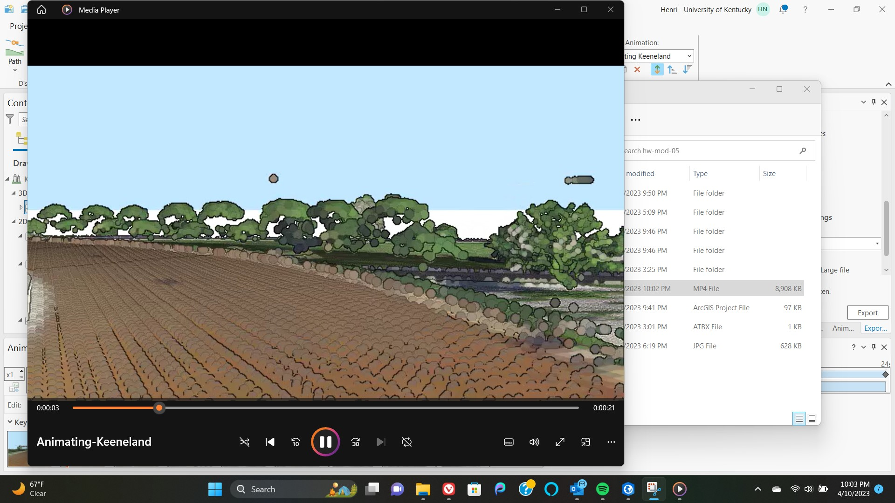

# keeneland-race-track
# Keeneland Race Track
The Keeneland Race Track was built in 1936 and has since become a hotspot for the equestrian industry as well as tourism in Kentucky.

     
*A 3D illustration of Fayette County's Most famous race track.*

     
*[Animating Keeneland](https://youtu.be/MCimzVKCKZ8)*